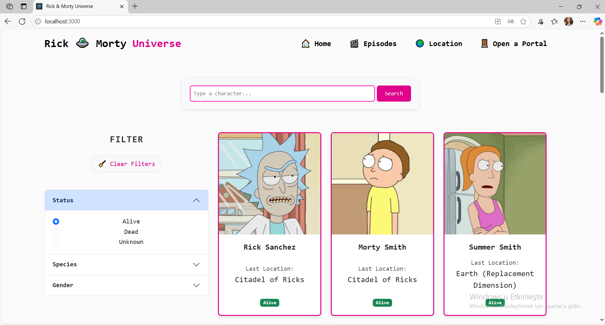
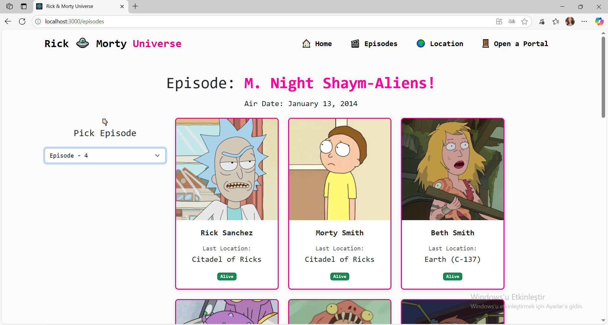
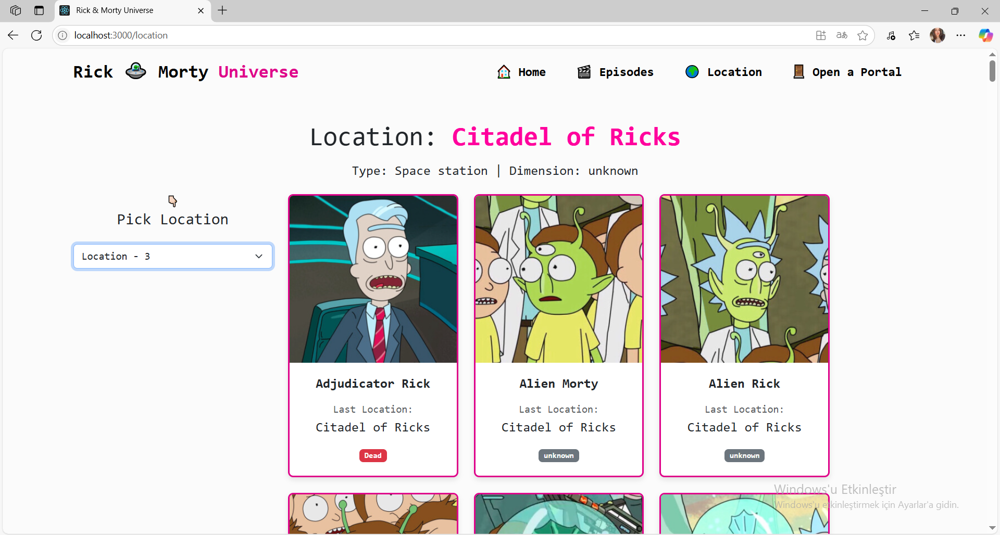
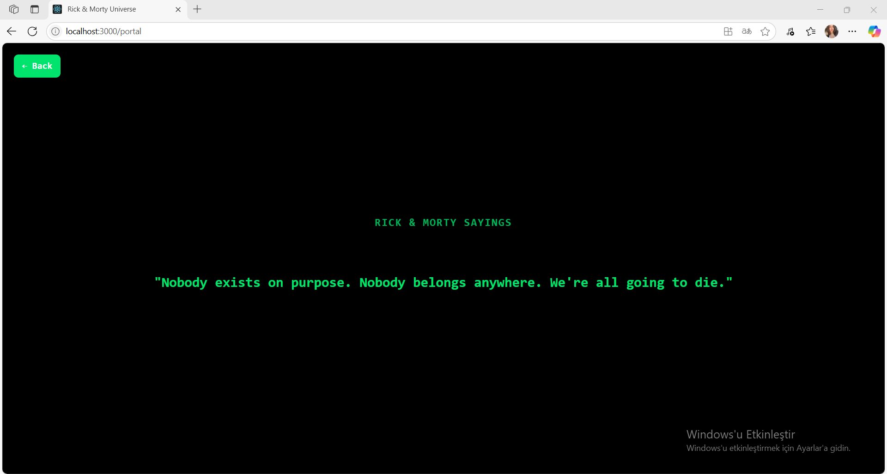

# 🧪 Rick and Morty Karakter Filtreleme Uygulaması

Bu uygulama [Rick and Morty API](https://rickandmortyapi.com/) üzerinden alınan verilerle **React.js** ve **Bootstrap 5** kullanılarak geliştirilmiş, kullanıcıların dizi karakterlerini:

- `status` (yaşayıp yaşamadığına)  
- `species` (türlerine)  
- `gender` (cinsiyetlerine)  
- `location` (yaşadıkları yer)  
- `episodes` (göründükleri bölümler)

filtreleyebildiği bir web uygulamasıdır.

---

## 🚀 Proje Özellikleri

- 👤 Rick and Morty karakterlerini listeleme  
- 🔎 Dinamik filtreleme (Status, Species, Gender, Location, Episodes)  
- 📲 Responsive arayüz (Bootstrap 5 ile)  
- 🔄 Sayfalama (Pagination)  
- 🌐 REST API kullanımı  
- ⚠️ Yüklenme ve hata durumları için kullanıcı bilgilendirme  

---

## 🛠️ Kullanılan Teknolojiler

| Teknoloji             | Açıklama                                           |
|-----------------------|----------------------------------------------------|
| **React.js**          | Component tabanlı modern frontend mimarisi         |
| **Bootstrap 5**       | Responsive UI tasarımı ve hazır stil bileşenleri   |
| **JavaScript (ES6+)** | Modern sözdizimi ve dinamik programlama desteği    |
| **Rick and Morty API**| Dış kaynaklı veri çekimi için RESTful API          |
| **Axios / Fetch API** | API'den veri çekme ve asenkron veri işleme         |
| **NPM**               | Paket yönetimi ve proje bağımlılık kontrolü        |

---

## 📸 Proje Ekran Görüntüleri

Aşağıda projeye ait bazı ekran görüntülerini bulabilirsiniz:






---

## 🔧 Projeyi Çalıştırmak İçin

```bash
# Depoyu klonla
git clone https://github.com/sudecivgin/RickMorty_characters.git

# Klasöre geç
cd REACT_RM

# Gerekli paketleri yükle
npm install

# Uygulamayı başlat
npm start
